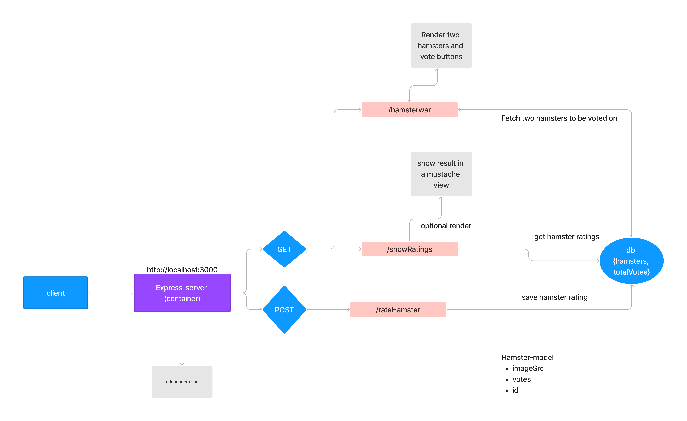

# 3e Mars

## Live-kod

[Live coding examples](live-coding/)

<details>
<summary>Setup npm with express</summary>
<br>

cd to desired working directory
1. create a file called server.js
2. npm init
3. npm install express && npm install --save-dev nodemon

In package.json modify
1. add "type": "module"
2. in "script" add another command
   1. "dev": "nodemon server.js"

You can now run the server with "npm run dev"

In server.js
```js
import express from 'express';

/* Serer init parameter */
const app = express();
const addr = "127.0.0.1";
const port = 3000;

/* Resource routes */
app.get("/", (request, response) => { // <-- http://127.0.0.1:3000/
  response.send("You successfully pinged the root resource");
});


/* Server startup */
app.listen(port, addr, () => { // http://localhost:3000
  console.log(`Server initialized on addr ${addr}`);
  console.log(`Port ${port} is used for server traffic`);
}); // There server awaits connections

```

To add template engine support simply install the package, e.g. "npm install mustache-express" and then add the engine
```js
//const express = require('express') <-- icke module
import express from 'express';
import path from 'path';
import url from 'url';
import mustache from 'mustache-express';

/* configure working directory path */
const __filename = url.fileURLToPath(import.meta.url);
const __dirname = path.dirname(__filename); // Current working directory

/* Serer init parameter */
const app = express();
const addr = "127.0.0.1"; // <-- localhost
const port = 3000;

/* configure template engine */
app.engine('html', mustache());
app.set('view engine', 'html'); // use files with .html
app.set('views', __dirname + '/views');

/* Routes and remainder of code */
```
<br>
</details>


## Material
- [Express js A-Z (Se videon under för avsnittet om middleware)](https://www.youtube.com/watch?v=SccSCuHhOw0)
- [In depth middleware](https://www.youtube.com/watch?v=lY6icfhap2o)
- [Mustache documentation](https://mustache.github.io/mustache.5.html)

## Övning
Skapa en hamsterwars sida där du kan rösta på vilken hamster som är sötas av två hamstrar.

Sidan består av två bilder där du kan välja den ena eller den andra som sötast. När en hamster väljs så skickas svaret till servern där datan sparas. 

Alla hamster röstningar ska vara tillgängliga via en endpoint (GET) /result.




